<div align="center">

# 🎓 Schulabschluss ist nicht nur Ländersache

### Eine Self-Service-BI Data Story über Bildungsungleichheit in Deutschland: von der Bundesland- bis auf die Kreisebene


**Max Budde · John Kanto · Aaron Ziegler**
HTW Berlin · Modul **W2-AA Analytische Anwendungen** · Prof. Dr. Martin Kempa

</div>

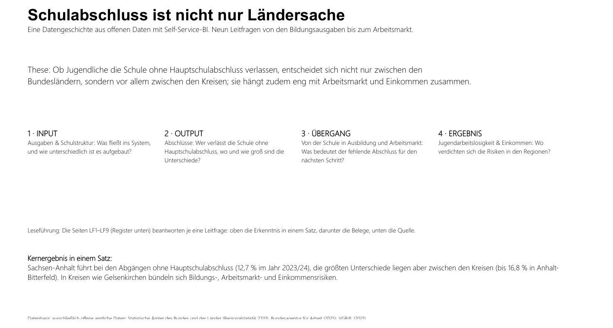

---

> ### 💡 Unsere Leitthese
> **Bildungserfolg ist kein reines Länderphänomen; er wird *lokal* entschieden.**
> Der Bundesland-Durchschnitt gibt nur den Rahmen vor. Wo und für wen Bildung wirklich gelingt oder scheitert, zeigt sich erst auf der Kreisebene. Genau dorthin folgen wir den Daten und verknüpfen sie mit Schulstruktur, Bildungsausgaben, Arbeitsmarkt und Einkommen.

Wir sind ein dreiköpfiges Team im Modul *Analytische Anwendungen* und haben diese Data Story vollständig mit **Power BI Desktop** und **ausschließlich offenen Daten** (Destatis / Regionalstatistik, Datenlizenz Deutschland 2.0) umgesetzt. Der rote Faden ist ein Daten-Flow in vier Stufen: **INPUT → OUTPUT → ÜBERGANG → ERGEBNIS**, dem der Bericht von Anfang bis Ende folgt.

<div align="center">

| 🧱 Modell | 📊 Bericht | 🎨 Gestaltung | ✅ Qualität |
|:--:|:--:|:--:|:--:|
| 9 Fakttabellen · 4 Dimensionen | 11 Seiten · 68 Visuals | Okabe-Ito-Farbvertrag | 113/113 Tests grün |
| 34 Measures (23 analytisch + 11 Formatierung) | 1 Karte · 6 Slicer | CVD- & WCAG-geprüft | jede KPI rohdaten-nachgerechnet |

</div>

---

## 🔍 Die Data Story in 9 Leitfragen

### Block 1 · Der Befund: *wo und wie stark?*

#### LF1 — Welche Bundesländer führen bei Abgängen ohne Abschluss?
**Unsere Antwort:** Sachsen-Anhalt steht an der Spitze (**12,66 %** Abgänge ohne Hauptschulabschluss, 2023); die Quote ist gegenüber dem Vorjahr **gestiegen**. Es folgen die ostdeutschen Länder, Bremen und Schleswig-Holstein; Bayern liegt mit **~5,4 %** am niedrigsten. Die beiden Schuljahre 2022/23 und 2023/24 zeichnen wir als Vergleichspaar (Blau/Orange) auf einer bei null beginnenden Achse; das Schuljahr fürs linke Ranking wählt ein Slicer direkt neben dem Diagramm (Vorauswahl 2023/24), der Jahresvergleich rechts bleibt davon unberührt.

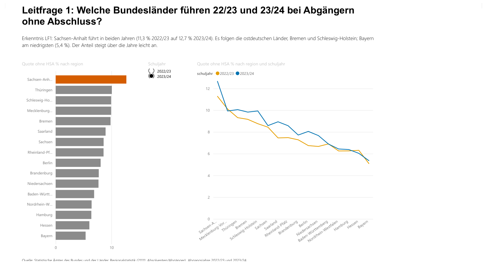

#### LF2 — Wo ist der Anteil ohne Hauptschulabschluss am höchsten?
**Unsere Antwort:** Auf Kreisebene schießen einzelne Hotspots bis **~17 %** (Anhalt-Bitterfeld 16,8 %, Pirmasens 16,5 %); weit über jedem Landesschnitt. Die Deutschlandkarte (Blasengröße = Quote) macht die räumliche Ballung sichtbar.

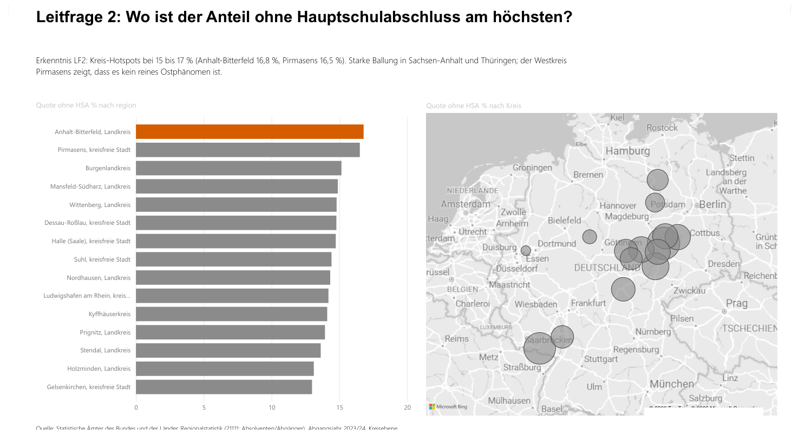

#### LF3 — Länder- oder Kreisproblem? Wie stark streuen die Kreise?
**Unsere Antwort:** Es ist **beides**. Unser Dot-Plot legt einen Punkt je Kreis über die Bundesländer und zeigt: *innerhalb* der Länder streuen die Kreise stark (Rheinland-Pfalz: Standardabweichung **2,84 pp**). Der Landesschnitt verdeckt große kommunale Unterschiede: Bildungsrisiko ist auch ein Kreisproblem.

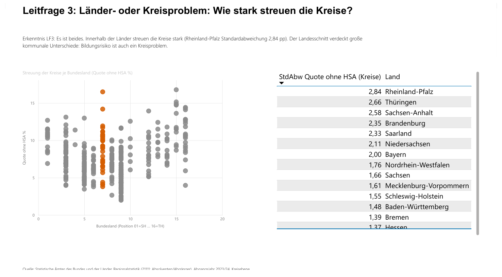

### Block 2 · Die Struktur: *wodurch geprägt?*

#### LF4 — Schneiden Jungen und Mädchen unterschiedlich ab?
**Unsere Antwort:** Ein klares, **strukturelles** Gefälle (kein regionaler Effekt): Jungen bleiben häufiger ohne HSA (**8,4 % vs. 5,8 %**), Mädchen erreichen häufiger das Abitur (**37,1 % vs. 29,3 %**). Zwei große KPI-Karten zeigen die **Abweichung zwischen den Geschlechtern** in Prozentpunkten (ohne HSA **2,6 pp** / Abitur **7,8 pp**). Über einen **Bundesland-Filter** lässt sich das Gefälle je Land prüfen; es reicht von 1,6 pp (Saarland) bis 4,8 pp (Sachsen-Anhalt), die Richtung bleibt überall gleich.

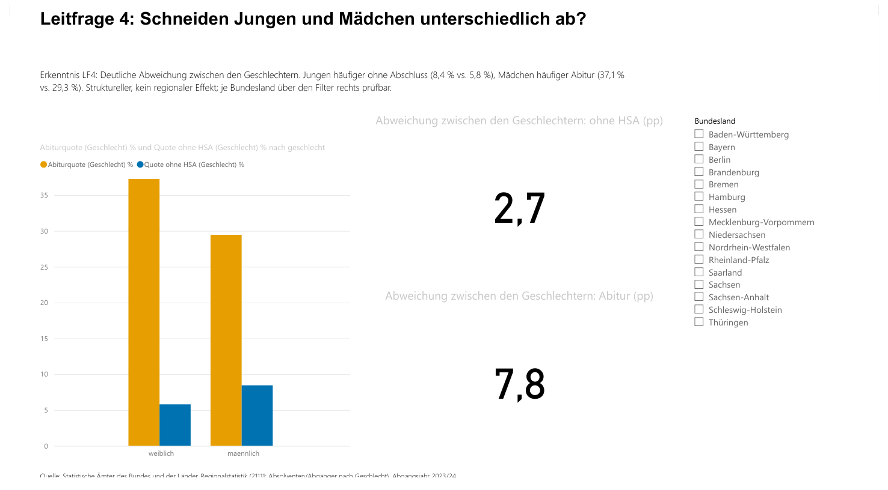

#### LF5 — Prägt der Schulartmix die Abschlussverteilung?
**Unsere Antwort:** Ja, **massiv**; und das konnten wir erst mit einer zusätzlich erschlossenen Quelle wirklich beantworten (siehe Abschnitt *Hürden*, Punkt 2). Von **55.705** Abgängen ohne Hauptschulabschluss in Deutschland (2023) entfallen **41,9 % (23.324) auf Förderschulen**, 22 % auf integrierte Gesamtschulen, 16 % auf Schularten mit mehreren Bildungsgängen, von Gymnasien praktisch keine. Links zeigen wir die Input-Struktur der Schülerschaft, rechts die tatsächliche Wirkung je Schulart. Ein **Bundesland-Filter wirkt bewusst nur auf das rechte Diagramm**, so lässt sich die Schulart-Struktur der Abgänge ohne HSA je Land betrachten, während links die bundesweite Schülerstruktur als feste Referenz bestehen bleibt (die Schülerzahlen-Quelle liegt nur für Deutschland vor).

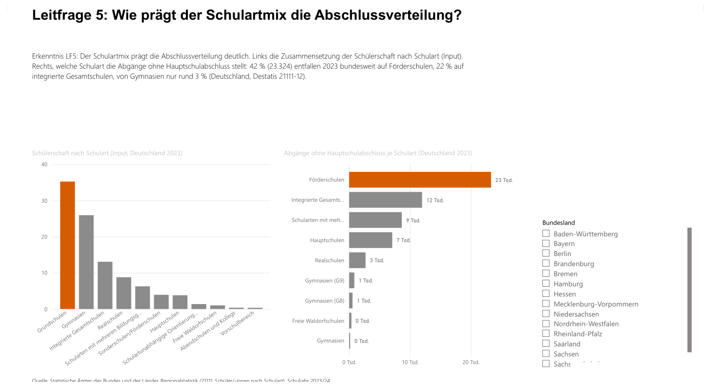

#### LF6 — Ändert sich die Wertung, wenn man relativ statt absolut zählt?
**Unsere Antwort:** Die Rangfolge **kippt komplett**. Absolut führen die bevölkerungsreichen Länder (NRW), pro 1.000 der 15- bis 18-Jährigen führt **Sachsen-Anhalt (41,6)**. Die Bezugsgröße entscheidet über das Ranking; die relative Betrachtung ist die fairere.

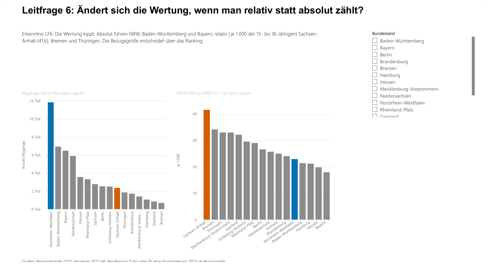

### Block 3 · Das Ökonomische: *was hängt zusammen?*

#### LF7 — Wie verteilen sich die Bildungsausgaben?
**Unsere Antwort:** Die Ausgaben je Schüler steigen mit der Schulart, von der Grundschule (**8.400 €**) bis zur integrierten Gesamtschule (**11.600 €**, Deutschland 2023). Zwischen den Ländern reicht die Spanne bis zu den Stadtstaaten, die am meisten ausgeben (Berlin ~13.500 €).

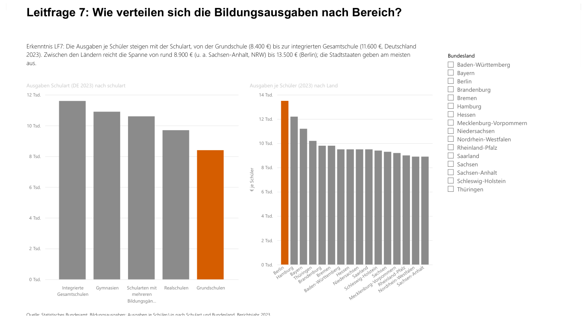

#### LF8 — Mehr Geld = bessere Abschlüsse?
**Unsere Antwort:** **Nein.** Der scheinbar positive Zusammenhang (r = **+0,61**) ist ein **Stadtstaaten-Artefakt**: Klammert man die drei Stadtstaaten aus, kippt er ins Nicht-Signifikante (r = **−0,36**, n. s.). Wir weisen den Confounder offen aus, statt einen bequemen Schluss zu ziehen. Ein **Stadtstaat/Flächenland-Slicer** macht das interaktiv erlebbar: blendet man die Stadtstaaten aus, kippt die Trendlinie im Bericht sichtbar. (Beide Achsen sind über getrennte Jahresfilter auf 2023 fixiert, die Ausgaben-Quelle enthält 2010–2024, die Abgänge-Quelle 2022/2023; da nur letztere an der Zeit-Dimension hängt, sind bewusst zwei Filter nötig.)

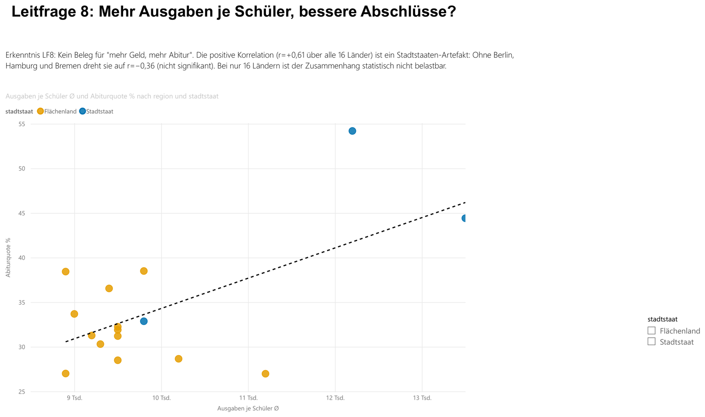

#### LF9 — Welche Kreise verbinden Bildungsrisiko, Arbeitslosigkeit und niedriges Einkommen?
**Unsere Antwort:** Unser **dreidimensionaler Risiko-Score** (Bildungsrisiko + Jugendarbeitslosigkeit + niedriges **verfügbares Einkommen je Einwohner**, z-standardisiert über 398 Kreise) führt **Gelsenkirchen (8,08)** vor Pirmasens und Mansfeld-Südharz. Der Dot-Plot je Bundesland zeigt: Hochrisiko-Kreise liegen in **West wie Ost**. Ein **Balkendiagramm** der höchsten Risiko-Kreise, die Ranking-Tabelle und die Methodik-Box machen die Berechnung transparent; über Slicer und einen Einkommens-Schieberegler ist die Seite interaktiv.

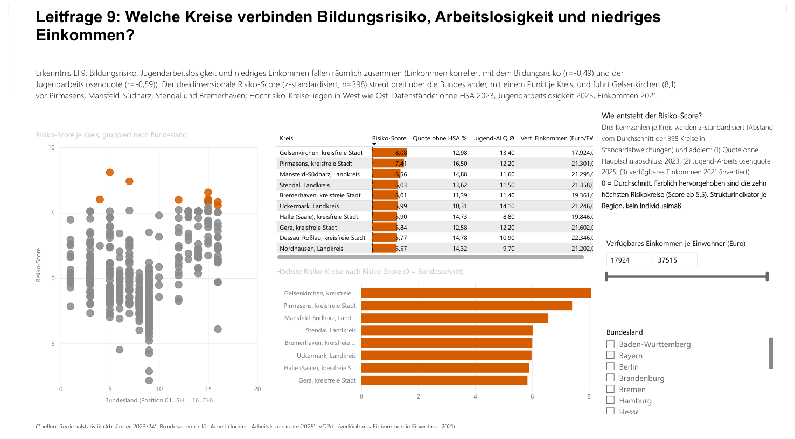

### Block 4 · Der Übergang: *und was kommt danach?*

#### Übergang — Was leisten die beruflichen Schulen?
**Unsere Antwort:** Berufliche Schulen wirken als **Aufstiegspfad**: Ein großer Teil der Abgängerinnen und Abgänger erreicht dort einen mittleren Abschluss, die Fachhochschulreife oder sogar die allgemeine Hochschulreife und nicht nur den Hauptschulabschluss. Die **zu 100 % gestapelte Säule** zeigt den Abschlussmix je Bundesland unabhängig von der Landesgröße; er fällt deutlich unterschiedlich aus. Die vier Abschlussarten summieren sich sauber auf die Gesamtzahl (keine versteckte Restkategorie), die Verteilung ist also ehrlich vollständig.

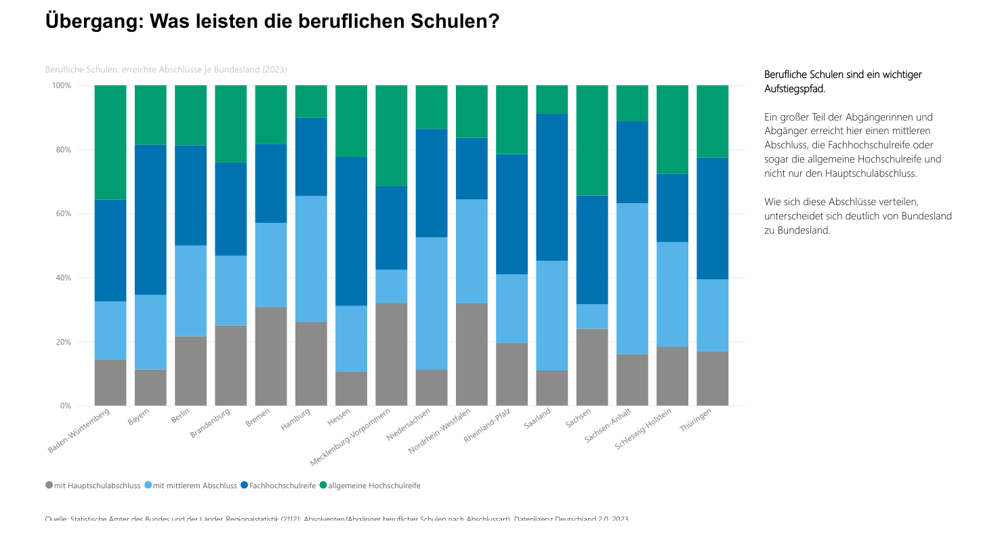

> **Durchgehender Grundsatz: Korrelation ≠ Kausalität.** Konfidenz-Vorbehalte, Confounder und der ökologische Fehlschluss (Kreis- vs. Individualebene) sind im Bericht offen ausgewiesen.

---

## 🧱 Das Datenmodell

Wir haben ein **dimensionales Sternschema (Kimball)** direkt in TMDL gepflegt: **9 Fakttabellen** an **4 konformen Dimensionen**, alle über `region_code` (AGS) 1:n und in einer Richtung verbunden: ein reines Sternschema ohne m:n.

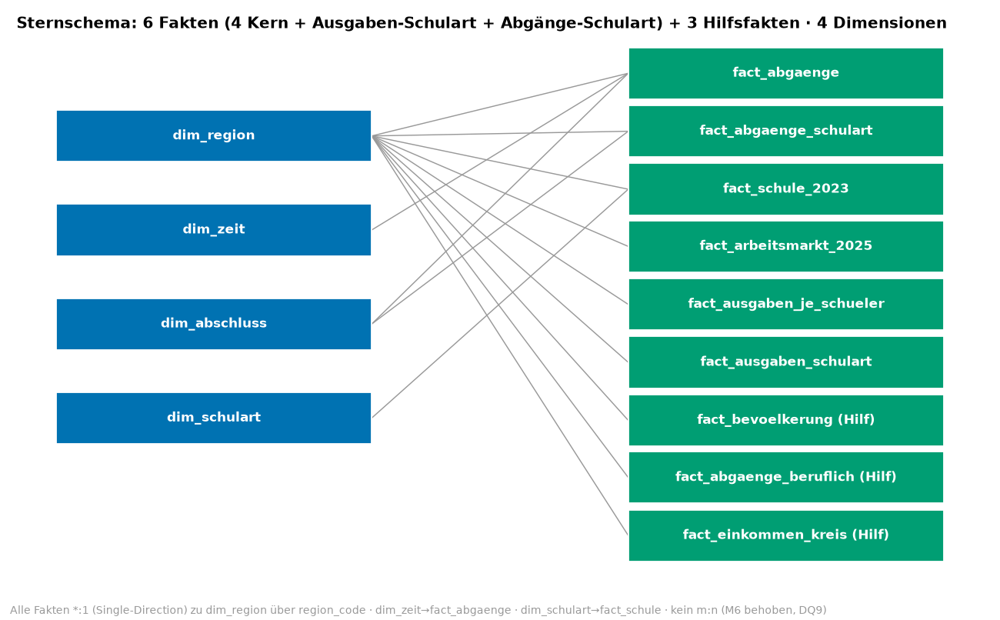

- **Dimensionen (4):** `dim_region` (mit Hierarchie Land → Regierungsbezirk → Kreis, SCD Typ 1), `dim_zeit`, `dim_abschluss`, `dim_schulart`.
- **Fakten (9):** `fact_abgaenge`, `fact_abgaenge_schulart` *(LF5-Antwort, neu)*, `fact_schule_2023`, `fact_arbeitsmarkt_2025`, `fact_ausgaben_je_schueler`, `fact_ausgaben_schulart` + drei Hilfsfakten (`fact_bevoelkerung_2023_2024`, `fact_abgaenge_beruflich_2023`, `fact_einkommen_kreis`).
- **34 Measures** in `dim_abschluss.tmdl`: **23 analytische** (Quoten, Anteile, Streuung, 3-dim Risiko-Score, Dot-Plot-Position) + **11 Formatierungs-Measures** (`Farbe …`, Conditional Formatting „nach Feldwert").
- **Aufbereitung zu 100 % in Power Query (M)** aus `data/raw`: Encoding, Missing-Handling, Wide→Long, AGS-Ableitung und Dezimal-Locale passieren im Modell, es gibt **kein vorgelagertes Cleaning** außerhalb des BI-Werkzeugs.

---

## 🎨 Gestaltung & Farbvertrag

Damit die Visualisierungen **nicht manipulativ** wirken, folgen wir einem berichtsweiten Farbvertrag nach anerkannten Standards (Okabe-Ito/CUD, IBCS, WCAG, Datawrapper):

| Farbe | Bedeutung |
|--|--|
| 🟧 Vermillion `#D55E00` | Fokus / Risiko (der eine Akzent je Visual) |
| ⬜ Neutralgrau `#8C8C8C` | Kontext (alles Übrige) |
| 🟦🟧 Blau `#0072B2` / Orange `#E69F00` | Vergleichspaar (die zwei direkt gegenübergestellten Größen) |

Jede Farbe hat berichtsweit **eine** Bedeutung, ist **farbfehlsichtigkeits-** und **kontrastgeprüft**, und Achsen beginnen bei null. Details in [`BEFUNDE_UND_KORREKTUREN.md`](BEFUNDE_UND_KORREKTUREN.md).

---

## 🧗 Hürden, und wie wir sie gelöst haben

Diese Story war kein gerader Weg. Die lehrreichsten Stolpersteine:

1. **Die Dezimal-Falle (Faktor 10).** Unsere Quell-CSVs nutzen den **Punkt** als Dezimaltrennzeichen, unser Modell läuft aber auf Gebietsschema **de-DE**. Beim ersten Laden waren dadurch alle Quoten um den Faktor 10 verfälscht. Gelöst durch bewusstes **en-US-Parsing** in Power Query; seitdem stimmen die Kennzahlen mit den amtlichen Werten überein.

2. **Die LF5-Datenlücke.** Zunächst zeigte LF5 nur, *wie viele Schüler* es je Schulart gibt, nicht *wer* die Abschlüsse (nicht) erreicht: Die Abgangsdaten kannten keine Schulart. Statt die Frage schönzureden, haben wir eine **zweite offene Quelle** erschlossen (Destatis 21111-12: Abgänge nach Schulart × Abschlussart) und als eigene Fakttabelle ins Modell integriert. Erst damit beantwortet LF5 die Leitfrage wirklich und liefert den stärksten Befund der Story (Förderschulen 42 %).

3. **Login-Sperre bei GENESIS.** Eine gewünschte GENESIS-Tabelle war anmeldepflichtig. Statt Zugangsdaten zu hinterlegen, haben wir denselben Datenstand aus dem **frei verfügbaren Statistischen Bericht** gezogen; konsequent nur offene Daten, keine Anmeldung.

4. **Dot-Plots im nativen Power BI.** Ein echter Streifen-/Dot-Plot mit Bundesländern auf der X-Achse ist im nativen Streudiagramm nicht vorgesehen (die X-Achse muss numerisch sein). Wir haben die Bundesländer über ein **Positions-Measure** (01–16 aus dem AGS) auf eine Wertachse gelegt, so entstehen je Land vertikale Punktbänder mit **einem Punkt je Kreis**, und die Streuung wird direkt lesbar (LF3, LF9).

5. **Farben, die still verschwinden.** „Farbe nach Feldwert" greift in Power BI nur mit dem exakt richtigen Selektor, sonst bleibt die Einfärbung **wirkungslos, ohne jede Fehlermeldung**. Wir haben alle Akzente über dedizierte `Farbe …`-Measures verdrahtet und **jede Farbe am gerenderten Bericht** kontrolliert, statt dem JSON zu vertrauen.

6. **Doppelzählung über die Ebenen.** Unsere Fakttabellen enthalten Deutschland, Bundesländer und Kreise in *einer* Tabelle. Ohne Ebenen-Filter summieren absolute Kennzahlen doppelt. Wir filtern konsequent auf die passende Ebene bzw. nutzen `ISFILTERED`-Defaults (Deutschland), damit nichts doppelt zählt.

7. **Export- und Bild-Tücken.** Der PBIP↔PBIX-Export scheiterte zeitweise an Dateisperren (OneDrive, offene Instanzen), und das Berichts-PDF rendert einen „Power BI Desktop"-Stempel mit. Wir haben einen **reproduzierbaren Export- und Zuschnitt-Workflow** gebaut (alte Instanzen beenden, PDF → PyMuPDF/PIL-Crop), damit die Berichtsbilder in DOCX/PPTX sauber sind.

8. **Ehrlich bleiben.** An mehreren Stellen war die bequeme Interpretation die falsche: der LF8-Stadtstaaten-Confounder, LF5 (Struktur vs. gemessene Wirkung), der ökologische Fehlschluss auf Kreisebene. Wir haben diese Vorbehalte **offen ausgewiesen**, statt sie zu verschweigen.

---

## ✅ Qualitätssicherung

Wir haben nach dem Prinzip **„nicht verifizierbar = FAIL"** gearbeitet:

- **Binäre Akzeptanztest-Suite** (`scripts/verify_all.py`): rechnet **jede KPI unabhängig aus den Rohdaten nach** (Ground Truth) und prüft Modell, `.pbix` und Doku auf Konsistenz: aktueller Stand **113/113 grün**.
- **Mehrere Prüfrunden mit adversarialem Gegenlesen:** jede Aussage wird gegen Rohdaten *und* den gerenderten Bericht geprüft; Zahlen im Bericht sind zusätzlich live in Power BI abgeglichen.
- **Reproduzierbarkeit:** Das Modell lädt die offenen Rohdaten direkt aus `data/raw`; `data/clean/` und `data/kpi_referenzwerte.json` dienen **nur als Prüfbeleg**, nicht als Modellquelle.

```bash
python scripts/verify_all.py    # binäre Prüfsuite (KPIs · Modell · .pbix · Doku-Konsistenz), alle grün
```

---

## ▶️ Projekt öffnen & reproduzieren

1. **Power BI Desktop** → `powerbi/SchulabschlussDataStory.pbip` öffnen (Vorschaufunktion *„Power BI Project (.pbip)"* aktiviert).
2. Parameter **`DataFolder`** auf den lokalen `data/raw/`-Pfad setzen (`expressions.tmdl`) und **Aktualisieren**.
3. Für die Karte: *Optionen → Sicherheit → „Verwenden von Kartenvisuals und Flächenkartogrammen"* aktivieren (Bing-Geokodierung öffentlicher Gebietsnamen).
- Alternativ öffnet die self-contained **`.pbix`** ohne Pfad; die Daten sind eingebettet.

Die Python-Skripte dienen ausschließlich **Aufbereitungs-Vorlage, Referenzwert-Berechnung und Verifikation**; die BI-Umsetzung selbst (Aufbereitung, Modell, Measures, Visuals) liegt vollständig in Power BI.

---

## 📚 Datenquellen (offene Daten, DL-DE 2.0 / Destatis)

| Fluss-Stufe | Quelle | Ebene | Jahr |
|--|--|--|--|
| INPUT | Ausgaben je Schüler nach Schulart (Destatis 21711, XLSX) | Bundesland | 2023 |
| INPUT | Schulen & Schüler nach Schulart (21111-01-03-4) | Kreis | 2023 |
| OUTPUT | Abgänge allgemeinbildender Schulen (21111-02-06-4) | DE/BL/RB/Kreis | 2023 |
| OUTPUT | **Abgänge nach Schulart × Abschlussart** (Statist. Bericht 21111-12, XLSX) | Bundesland | 2022 & 2023 |
| ÜBERGANG | Berufliche Schulabschlüsse (21121-02-02-4) | Kreis | 2023 |
| ERGEBNIS | Jugend-Arbeitslosenquote (13211-02-05-4) | Kreis | 2025 |
| ERGEBNIS | Verfügbares Einkommen je Einwohner, VGRdL (82411-01-03-4) | Kreis | 2021 |
| Hilfsgröße | Bevölkerung nach Altersgruppen (12411-02-03-4) | Kreis | 2023 |

Abruf 06/2026. Nur öffentlich zugängliche Daten, keine Anmeldung, keine personenbezogenen Daten.

---

## 📁 Repo-Struktur

```
powerbi/            Power-BI-Projekt (PBIP): TMDL-Modell + Power-Query-M + Report-Definition + .pbix
data/raw/           offene Rohdaten (Regionalstatistik-CSV, Destatis-XLSX), Modellquelle
data/clean/         bereinigte Tabellen, nur Prüfbeleg (NICHT Modellquelle)
scripts/            Reproduktions- & Prüf-Skripte (Python); verify_all.py = Ground-Truth-Testsuite
charts/pbi/         die in DOCX/PPTX & hier eingebetteten Power-BI-Berichtsseiten
Schulabschluss_DataStory_Dokumentation.docx   ausführliche Doku (roter Faden)
Schulabschluss_DataStory_Praesentation.pptx   Präsentation
*.md                Schema, Analyseabfragen (DAX), Datenqualität, Befunde, Traceability …
```

---

<div align="center">

### 👥 Team

**Max Budde** · **John Kanto** · **Aaron Ziegler**
HTW Berlin · W2-AA Analytische Anwendungen · Prof. Dr. Martin Kempa · 2026

*Bildungserfolg wird lokal entschieden, und mit offenen Daten sichtbar.*

</div>
