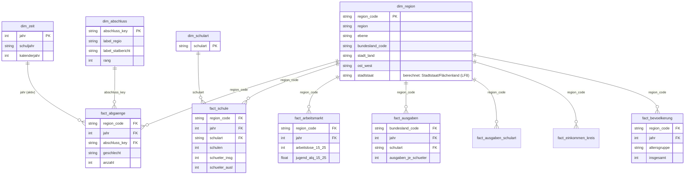

# Dimensionales Schema (REQ-052, REQ-038) – Sternschema gemäß Präsentation S10

> Verbindlich aus Primärquelle S10: **genau 4 Fakten** (Abgänge, Schule, Arbeitsmarkt, Ausgaben) + **4 Dimensionen** (Region, Zeit, Abschluss, Schulart). Geschlecht/Alter = Attribute (keine eigene Dimension, ESK-01 vermieden).
> Hilfstabelle `fact_bevoelkerung` (Denominator) implementiert die in S08 gelistete Quelle „Bevölkerung" und bedient LF6 (relativ statt absolut) – keine Scope-Erweiterung, sondern Umsetzung einer gelisteten Quelle/Leitfrage.

## Sternschema

**Maßgebliche Diagramm-Darstellung: die Modellansicht aus Power BI Desktop** (`charts/pbi_model.png`, in die DOCX eingebettet) – sie zeigt das reale Beziehungsmodell (Fakten rund um die konforme Dimension `dim_region`, 1:n Single-Direction).

Ergänzend als textbasierte ER-Darstellung derselben Struktur (kein separates Bild, nur zur Lesbarkeit im Markdown):

## Fakten (4 + 1 Hilfstabelle) – logisches Mapping

> Die Spalte Clean-Quelle benennt die **logische Tabelle je Fakt** (identisch als Referenz-CSV unter `data/clean` abgelegt). Das **Live-Modell baut genau diese Tabellen in Power Query M direkt aus `data/raw`** (Roh-CSV/-XLSX) auf; die `data/clean`-CSV sind reiner Prüfbeleg, keine Modellquelle.
| Fakt (S10) | Clean-Quelle(n) | Grain | Kennzahlen | Leitfragen |
|---|---|---|---|---|
| **Abgänge** | `fact_abgaenge_kreis_2023` (2023, alle Ebenen) + `fact_abgaenge_land` (2022 BL) → vereinheitlicht in P3 | Region × Jahr × Abschluss × Geschlecht | Abgänge, Quote ohne HSA, Abschlussquoten | LF1–LF4, LF6 |
| **Schule** | `fact_schule_2023` | Region × Jahr × Schulart | Schulen, Schüler, Anteil ausländisch | LF5 |
| **Arbeitsmarkt** | `fact_arbeitsmarkt_2025` | Region × Jahr | Jugend-ALQ, Arbeitslose 15–25 | LF9 |
| **Ausgaben** | `fact_ausgaben_je_schueler` (+ Detail `21711-02/03`) | Bundesland × Jahr × Schulart | Ausgaben je Schüler | LF7, LF8 |
| *(Hilf)* **Bevölkerung** | `fact_bevoelkerung_2023_2024` | Region × Jahr × Altersgruppe | Bevölkerung (Nenner) | LF6 |
| *(Übergang)* **Abgänge beruflich** | `fact_abgaenge_beruflich_2023` | Region × Jahr × Abschluss | nachgeholte Abschlüsse | Flow-Stufe ÜBERGANG (S06) |
| *(Hilf)* **Einkommen** | `fact_einkommen_kreis` (VGRdL, 82411-01-03-4, 2021) | Region × Jahr | verfügbares Einkommen je Einwohner | LF9 (Risiko-Score, Einkommensdimension) |

## Dimensionen (4) – Mapping
| Dimension (S10) | Clean-Tabelle | Schlüssel | Attribute |
|---|---|---|---|
| **Region** | `dim_region` (523) | region_code (AGS) | region, ebene (DE/BL/RB/KR), bundesland_code, stadt_land, ost_west, `stadtstaat` (berechnet: Stadtstaat/Flächenland; Farbtrennung LF8) |
| **Zeit** | `dim_zeit` | jahr | schuljahr, kalenderjahr |
| **Abschluss** | `dim_abschluss` (5) | abschluss_key | label_regio, label_statbericht, label_s09, rang (Mapping über Quellen) |
| **Schulart** | `dim_schulart` (12) | schulart | – |

## Beziehungen & Modellierungsregeln (REQ-038) – wie LIVE umgesetzt
- Zentrale Verbindungsdimension: **Region** (`region_code`) an allen 9 Fakttabellen (1:n) – d. h. 6 physische Fakten (4 Kern-Fakten der S10-Vision inkl. Ausgaben nach Schulart und Abgänge nach Schulart × Abschlussart, LF5) + 3 Hilfsfakten (Bevölkerung, berufliche Abgänge, Einkommen).
- **Zeit** (`dim_zeit[jahr]`) ist **aktiv nur an `fact_abgaenge`** verknüpft – das ist die einzige echte Mehrjahres-Analyse (Schuljahre 2022/23 + 2023/24). Die übrigen Fakten sind **Einzeljahr-Snapshots** (Schule 2023, Arbeitsmarkt 2025, Bevölkerung als 2023-gefilterte Hilfsgröße) bzw. **Mehrjahres-Ø** (Ausgaben 2010–2024) und benötigen keine Zeit-Beziehung. Bezugsjahr der abgängebasierten Visuals = **2023** (Bericht-Filter, DQ11).
- **Abschluss** an Abgänge; **Schulart** an Schule.
- **Ausgaben** (gesamt + nach Schulart) sind auf Bundesland-/Deutschland-Ebene verfügbar; den Tabellen wurde ein **`region_code`** ergänzt (Name→AGS), sodass die Beziehung als sauberes **`region_code` → `dim_region[region_code]` (\*:1, Single-Direction)** läuft – kein m:n und kein Klartext-Namensschlüssel (M6 behoben, vgl. DQ9). Bei `fact_ausgaben_schulart` dient `schulart` als native Spalte (Achse für LF7), ohne eigene Beziehung zu `dim_schulart`. Auswertung auf BL/DE-Ebene (Visual-Filter `ebene=BL` bzw. `bundesland=Deutschland`).
- Geschlecht als Attribut/Degenerate Dimension in Abgänge (für LF4-Gap), KEINE eigene Dimension.
- Grundmuster durchgängig: **1:n Dimension→Fakt, Single-Direction (reines Sternschema)** über Schlüsselspalten. Kein Schneeflocken-/Vault-Aufbau – Data-Vault-Einordnung siehe Doku Phase 7, LI4.

## Region-Hierarchie (Parent-Child, Drilldown)
Statt sich allein auf die flache `ebene`-Spalte zu verlassen, trägt `dim_region` eine echte Hierarchie **Land → Regierungsbezirk → Kreis** (Modell-Objekt „Land Hierarchie"). Die drei Hierarchiestufen sind aus dem AGS abgeleitet:
- `Land` = Bundesland-Name über die ersten zwei AGS-Stellen (`LOOKUPVALUE … LEFT(region_code,2)`).
- `Regierungsbezirk` = Name der AGS-Mittelstufe (erste drei Stellen). Fachlich genau: Diese Stufe umfasst je nach Land **Regierungsbezirke** (z. B. NRW, Bayern) **oder Statistische Regionen** (z. B. Niedersachsen: Braunschweig/Hannover/Lüneburg/Weser-Ems) — beides ist die NUTS-2-nahe Mittelebene des AGS. Länder ohne diese Mittelstufe erhalten „ohne Regierungsbezirk". (Der Hierarchie-Stufenname „Regierungsbezirk" steht stellvertretend für diese AGS-Mittelebene.)
- `Kreis` = Regionsname auf Kreisebene.

Damit ist der in REQ-002 vorgesehene Drilldown Land → Regierungsbezirk → Kreis modellseitig als Hierarchie hinterlegt und nicht mehr nur über manuelle Ebenen-Filter erreichbar. Die vorab aggregierten DE/BL/RB-Zeilen bleiben erhalten (sie stammen direkt aus der amtlichen Quelle); zur Vermeidung von Mehrfachzählung über die Ebenen filtern die kennzahlenführenden Visuals weiterhin auf die jeweils richtige `ebene` (z. B. `ebene=KR` für Kreis-Auswertungen). Eine reine Blatt-Granularität (nur Kreis-Fakten) ist nicht möglich, weil die 2022er-Abgänge quellseitig nur auf Bundeslandebene vorliegen.

## Slowly Changing Dimensions (Gebietsstand)
`region_code` (AGS) ist der natürliche, zeitstabile Schlüssel der Region; der Regionsname ist nicht eindeutig (9 doppelte Namen, vgl. DQ9, durch Gebietsreformen wie die sächsische Kreisreform 2008 oder Göttingen 2016). Das ist konzeptionell ein SCD-Problem. Bewusste Entscheidung: **SCD Typ 1 auf den Gebietsstand 2023** – das Modell führt genau einen, aktuellen Gebietsstand; veraltete Codes ohne 2023er-Daten bleiben in `dim_region`, tragen aber keine Faktdaten und sind damit inaktiv. Eine Typ-2-Historisierung (Gültigkeitsintervalle je Gebietsstand) wäre nur bei fortlaufenden, mehrjährigen Lieferungen mit wechselnden Gebietsständen sinnvoll; bei den hier genutzten Einzel-Stichjahren wäre sie Overengineering. Alle Joins laufen über den eindeutigen `region_code`, nie über den Namen.

## Bus-Matrix (Kimball)
Konforme Dimension über alle Prozesse ist **Region**; `Zeit` ist konform, aber nur an Abgängen aktiv verknüpft (übrige Fakten sind Einzeljahr-Snapshots bzw. Mehrjahres-Ø).

| Faktprozess | Region | Zeit | Abschluss | Schulart |
|---|:--:|:--:|:--:|:--:|
| Abgänge (allgemeinbildend) | X | X (aktiv) | X | – |
| Schule | X | (2023) | – | X |
| Arbeitsmarkt | X | (2025) | – | – |
| Ausgaben (gesamt) | X | (Ø/2023) | – | (Attribut) |
| Ausgaben nach Schulart | X | (2023) | – | (Attribut) |
| Bevölkerung (Hilf) | X | (2023) | – | – |
| Abgänge beruflich (Hilf) | X | (2023) | X | – |
| Einkommen (Hilf) | X | (2021) | – | – |

## Additivität der Kennzahlen
| Measure | Additivität | Begründung |
|---|---|---|
| Abgänge / `anzahl` | voll-additiv | Mengen, über alle Dimensionen summierbar |
| Bev 15-18 | semi-additiv | Bestandsgröße: über Region additiv, über Zeit nicht |
| Quote ohne HSA %, Abiturquote %, Schüleranteil % | nicht-additiv | Quotienten, nur über Kontext neu zu berechnen |
| Ausgaben je Schüler Ø, Jugend-ALQ Ø | nicht-additiv | Durchschnitts-/Verhältniswerte |
| Ohne HSA je 1000 | nicht-additiv | Verhältnis (Zähler additiv, Nenner Bestand) |
| Risiko-Score, StdAbw Quote ohne HSA | nicht-additiv | z-standardisiert bzw. Streuungsmaß |

Konsequenz für den Bau: nicht-additive Measures werden als DAX-Measures (kontextabhängige Neuberechnung) geführt, nie als vorab summierte Spalten.

## Umsetzung in Power BI (Phase 3)
- Power-Query-Import **direkt aus `data/raw`**: Regionalstatistik-CSV (Windows-1252, `;`) und Destatis-XLSX; die gesamte Aufbereitung (Encoding, Missing, Wide→Long, AGS-Ableitung, Dezimal-Locale) läuft in Power Query M. Kein `data/clean`-Zwischenstand im Live-Modell (die `data/clean`-CSV existieren nur als Prüf-/Referenzbeleg).
- Vereinheitlichung Fakt Abgänge (2022 BL + 2023 alle Ebenen) in eine Long-Tabelle.
- Beziehungen wie oben; Measures in Phase 4 (DAX), verifiziert gegen Referenzwert.
